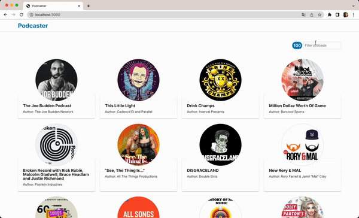

# :studio_microphone: Podcast

<p>
  
</p>

Podcast is an app for listening the 100 best podcast on iTunes.

Search the podcast that you like and enjoy listening their last episodes.



## :floppy_disk: Tech Stack

<p>


</p>

As server side, we are using localStorage after fetching the data for providing a better user experience.

## :desktop_computer: Run locally

Clone the project

```bash
  git clone https://github.com/Manosfrias/podcasts.git
```

Go to the project directory

```bash
  cd podcasts
```

Install dependencies

```bash
  npm install
```

Start the development mode

```bash
  npm run dev
```

Open [http://localhost:3000](http://localhost:3000) with your browser to see the result.

## :microscope: Running Tests

To run tests, run the following command

```bash
  npm run test
```

## :cloud: Deployment

To deploy this project run

```bash
  npm run buld
  npm run start
```

Open [http://localhost:3000](http://localhost:3000) with your browser to see the result.

## :woman_technologist: Contributing

For contributing, the use of [conventional commits](https://www.conventionalcommits.org/en/v1.0.0/) are required. For making it easy, [commitlint](https://commitlint.js.org/) is added on the repository. Just run the next code on your terminal and follow the step by step guide.

```bash
  npm run commit
```

Pull requests are welcome. For major changes, please open an issue first
to discuss what you would like to change.

Please make sure to update tests as appropriate.
